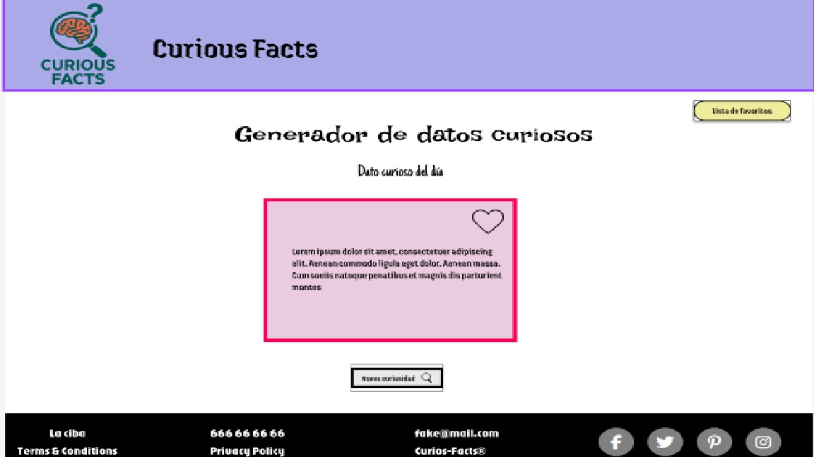
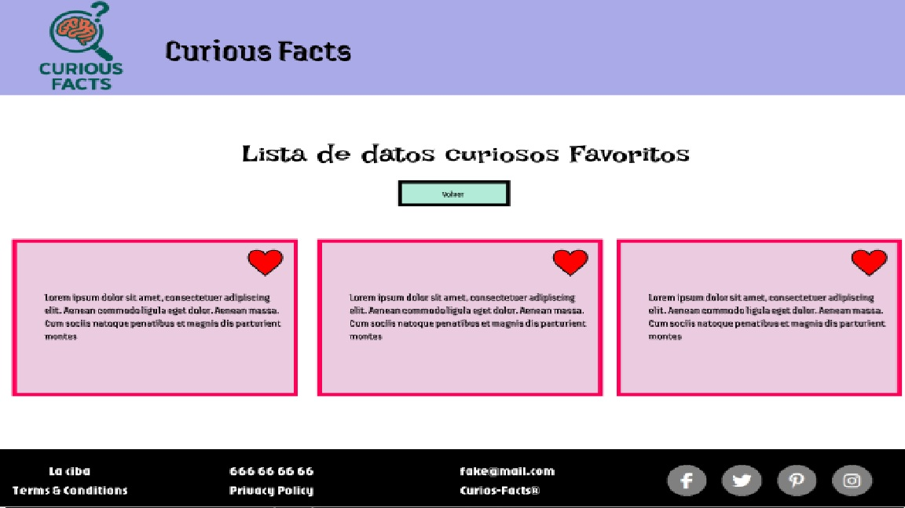

# 🌟 Curious Facts


---

## 📖 Descripción

**Curious Facts** es un generador web de datos curiosos que muestra un dato aleatorio cada día. Y después puede seguir generando otros datos aleatorios. 
Incluye funcionalidad para guardar favoritos y una interfaz moderna y responsive.  

¡Ideal para descubrir curiosidades y compartirlas!

---

## 🎬 Demo

  
  

💻 [Prueba la web en vivo](https://jennyx-1984.github.io/curious-facts/)
🔀 [Visita mi flowchart](https://drive.google.com/file/d/1mAvabYfHCooxf4hUO_VgJgX0vpKm_O5-/view?usp=sharing)
🎨 [Échale un ojo al diseño](https://www.figma.com/proto/PbiLWP86m53yGcMoUc2Mii/curios-facts?node-id=0-1&t=i0dRIJ5URI65JZK0-1)
📂 [Visita el repositorio de Github](https://github.com/Jennyx-1984/curious-facts)
📋 [Mi trayectoría durante el proyecto](https://trello.com/invite/b/692d64fa97a79212db231306/ATTI840f9d29ea9b340414f4e94468ff7d5a19FDFF8D/curios-facts)
🖌️ [Mi presentación del proyecto](https://www.canva.com/design/DAG6c40wyV0/UMP3V6JRWvoPi2SCuy_yWw/edit?utm_content=DAG6c40wyV0&utm_campaign=designshare&utm_medium=link2&utm_source=sharebutton)
---

## 🚀 Características
- Genera dato diario cada vez que carga la web sólo una única vez.
- Generador de datos curiosos aleatorios.
- Guardar favoritos y consultar lista.
- Botón de “me gusta” con corazón.
- Diseño responsive.
- Scroll automático para textos largos.
- Interfaz moderna y sencilla.
- Test Unitario.
- Cambio de idioma Inglés/Alemán. 
- SEO añadido

---

## 🛠 Tecnologías utilizadas

- HTML5 / CSS3 / JavaScript
- Bootstrap 5.3
- Google Fonts
- Font Awesome
- Node.js
- Vitest


---

## ⚙️ Instalación

1. Clona el repositorio o haz un fork:
2. Disfruta del proyecto

```bash
git clone https://github.com/Jennyx-1984/curious-facts.git
